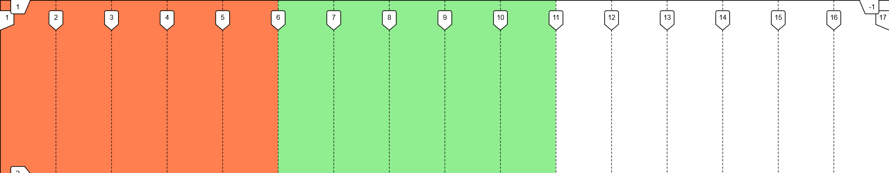

# ■boxes■

Simple grid-based CSS framework.

## Table of contents

- [Summary](#summary)
- [Installation](#installation)
- [How to use](#how-to-use)
  - [Grid system](#grid-system)
    - [Gaps](#gaps)
    - [Breakpoints](#breakpoints)
  - [Utilities](#utilities)
    - [Margin and Padding](#margin-and-padding)
    - [Display](#display)
    - [Grid items](#grid-items)
    - [Absolute centering](#absolute-centering)
  - [Configuration Options](#configuration-options)
- [License](#license)

## Summary

Use specific classes to streamline the process of creating your layouts, so that you can get more done in less time.

Also provides responsive variations for each class, making sure that your layout changes only when you want it to.

## Installation

You can clone the project and get the files you need.

Or...

You can use [npm](https://www.npmjs.com/):

    npm install @alexabcdev/boxes

And then all you have to do is import it in your project by doing:

    import '@alexabcdev/boxes/dist/main.min.css';

We also have a non-minified version you can inspect.

Finally, you can use the Sass modules directly from the `scss` folder and change the default settings (number of columns, breakpoints, etc.).

## How to use

### Grid system

The system is based on CSS grids.

To create a new grid, just add the class of `grid` to an element. Each grid is divided by the default number of columns (16, can be changed through `main.scss`). An element with a class of grid takes up 100% of their parent's width.

Now that we have a new grid, we can add elements to it and declare how much space they should take through the column classes.

```
col-{n1-16}
```

Go [here](#Breakpoints) for responsive variations.

Like this:

CSS

```css
.test1,
.test2 {
  height: 250px;
  width: 100%;
}

.test1 {
  background-color: coral;
}

.test2 {
  background-color: lightgreen;
}
```

HTML

```html
<div class="grid">
  <div class="test1 col-5"></div>
  <div class="test2 col-5"></div>
</div>
```

Result:



#### Gaps

We can also add gaps in between the columns through the `gap-{n1-5}` class. Each increment is multiplied by the spacing variable inside `main.scss` to get the final value.

#### Breakpoints

The grid can also be made responsive through the use of breakpoint variations with a pattern like this:

```
col-{breakpoint-name}-12
```

These are the default breakpoints (can be modified):

```scss
$grid-breakpoints: (
  xs: 0,
  sm: 576px,
  md: 768px,
  lg: 992px,
  xl: 1200px,
  xxl: 1400px,
) !default;
```

Note: the 'xs' breakpoint is the default one for all utility classes without a breakpoint variation specified. Meaning you write `col-5` instead of `col-xs-5`.

### Utilities

#### Margin and Padding

You can add margin and padding through these classes:

```
m-{n1-5}
m{direction}-{n1-5}

mx-{n1-5}
my-{n1-5}

mx-auto
```

Or with responsive variations:

```
m-{brekapoint-name}-{n1-5}
m{direction}-{breakpoint-name}-{n1-5}

mx-{brekapoint-name}-{n1-5}
my-{brekapoint-name}-{n1-5}
mx-{breakpoint-name}-auto
```

Directions:

```scss
$directions: (
  l: left,
  r: right,
  t: top,
  b: bottom,
);
```

#### Display

Change the display property of an element:

```
d-{value}
d-{breakpoint-name}-{value}
```

Possible values:

```scss
$display-types: flex grid block inline inline-block none;
```

#### Grid items

Align and justify items inside of grids:

```
galign-items-{value}
gjustify-items-{value}

galign-self-{value}
gjustify-self-{value}
```

Responsive:

```
galign-items-{breakpoint-name}-{value}
gjustify-items-{breakpoint-name}-{value}

galign-self-{breakpoint-name}-{value}
gjustify-self-{breakpoint-name}-{value}
```

Possible values:

```scss
$alignment-values: center start end stretch;
```

#### Absolute centering

Makes an element absolutely positioned and centers it.

`translate-middle`

### Configuration Options

```scss
$columns: 16 !default;

$property-basis: 0.5rem !default;
$property-multiples: 5 !default;

$grid-breakpoints: (
  xs: 0,
  sm: 576px,
  md: 768px,
  lg: 992px,
  xl: 1200px,
  xxl: 1400px,
) !default;
```

## License

[MIT](https://github.com/alessandrovinciabc/boxes/blob/main/LICENSE.MD)
